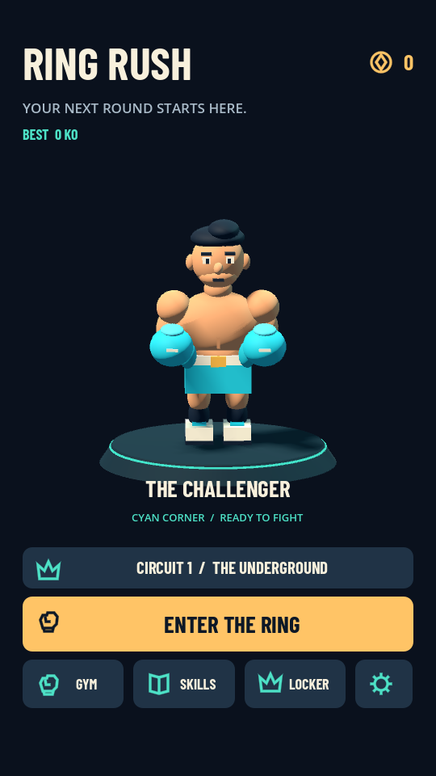

# Ring Rush

A portrait 3D boxing-survival game built with **Godot 4.5.1 / GDScript** for an Android/iOS pipeline. Detailed articulated fighters, an animated showroom, an arena with instanced spectators, and a reusable mobile core. Original procedural models, icons and sounds; Barlow Condensed is bundled under its OFL license.

**Status:** expanded playable desktop-validated prototype. Live native ads/billing, receipt validation, signed mobile binaries and physical Android/iOS testing are still pending. The locker labels all debug ads/purchases as simulations and never charges money. Release builds without a native provider report unavailable.

## Play

Import `project.godot` into Godot 4.5.1 and press **F5**, or run `run.command` on this Mac. The launcher finds `/Applications/Godot.app` or the temporary Godot runtime used during development. Set `GODOT_BIN` if needed.

```sh
GODOT_BIN=/Applications/Godot.app/Contents/MacOS/Godot ./run.command
```

| Action | Touch | Keyboard |
| --- | --- | --- |
| Move | Drag anywhere below the HUD, away from action buttons | WASD / arrow keys |
| Punch | Automatic, toward nearby opponents | Automatic |
| Dash | Dash button; can use a second finger while steering | Space |
| Special | Unleash button at 100% charge | E |
| Pause | Pause button | Esc |

Red ground circles telegraph incoming attacks. Dash grants brief invulnerability. Knockouts charge a large area special. Teal gems grant XP; every level offers three eligible skills and one free reroll is available per run.

## Complete the circuit

Survive a 90-second round and defeat its champion. The champion arrives at 75 seconds; if still alive at the bell, you have up to 30 seconds of overtime. A win banks the stage bonus and unlocks the next circuit. There are three circuits with different arena palettes and increasing difficulty: **The Underground**, **Neon Docks**, and **Golden Crown**. Champions share a telegraphed slam attack with stage-scaled health; they are not three separate boss move sets.

Enemies include standard boxers, fast runners, resilient brutes, and the champion. A combo indicator tracks consecutive knockouts. Damage prevention has a short shared invulnerability window so a crowd cannot deliver every contact hit simultaneously.

The gym provides five levels each of permanent power, conditioning, and starting special charge. The playbook describes every skill, and the pause menu shows your current build. The locker contains a cosmetic gold-glove test unlock and an optional simulated rewarded ad for training coins.

### Skills

18 stackable choices: Heavy hands, Quick combo, Long reach, Second wind, Ring shock, Light feet, Sweet spot, Iron guard, Steady breath, Prize fighter, Hot knuckles, Cold snap, Live wire, Fighting spirit, Satellite fists, Slip & strike, Main event, and Big heart.

These cover damage, attack speed, reach, healing, shockwaves, movement, critical hits, armor, regeneration, pickup attraction, burning, slowing, chain lightning, health on knockout, orbiting attacks, dash cooldown, special charge and maximum health. Each choice has a rank cap; capped skills are removed from the offer pool. Heals are not offered at full health.

## Robustness and performance

- Combat uses a fixed physics tick; movement and cooldowns do not depend on render rate.
- Forty-eight pooled enemies and 64 pooled pickups; no actor construction/destruction during combat. Model variants are prewarmed at startup and reuse the resulting mesh resources.
- Fighter details are baked into six shared animated mesh surfaces. The showroom hero has more geometry; small crowd actors use fewer segments.
- One instanced stadium-chair mesh, one audience mesh, and one instanced particle mesh. Pools cap effects at 192 particles, 12 expanding rings, 16 damage labels, and six audio voices.
- Spatial neighbor buckets limit crowd-separation checks. Battery saver removes dynamic shadows, the audience and 3D anti-aliasing.
- Gameplay pauses on app suspension/focus loss. Coins and knockout counts checkpoint every 15 seconds and on suspension; the next launch banks the last successful checkpoint. Active fights are not resumed, and a force-kill can lose progress since the last checkpoint.
- Result rewards, run records and stage unlocks commit together with a transaction ID. Repeat settlement cannot grant twice. Failed result writes expose a retry without discarding the result.
- A corrupted primary save can recover from a healthy backup. A future save schema blocks writes rather than downgrading the profile.
- Responsive phone/tablet layout and mobile safe-area offsets are implemented; actual cutouts and mobile input still need device verification.

See [validation and rendering measurements](docs/validation.md). Desktop timings are not a mobile performance guarantee.

## Reuse in another game

`addons/mobile_core/` contains save, commerce, touch input, VFX and audio services with no dependency on `game/`. Ring Rush owns its balance, models, UI, stage progression and skill rules. See [architecture](docs/architecture.md) and [mobile release integration](docs/mobile-release.md).

```text
addons/mobile_core/    Reusable services and provider interfaces
 game/                 Ring Rush actors, mesh factory, combat, skills, menus, progression
 scenes/main.tscn       Entry scene
 assets/               Icon, generated sounds, licensed display font
 tests/                Regression suite, deterministic captures, benchmarks
 docs/                 Integration notes, measurements and actual engine captures
```

## Verify

```sh
godot --headless --path . --editor --import --quit
godot --headless --path . --script res://tests/run_tests.gd
godot --path . --script res://tests/capture.gd --resolution 540x960
godot --path . --script res://tests/performance.gd --resolution 540x960 --disable-vsync -- /tmp/ring-render.json
godot --path . --script res://tests/performance.gd --resolution 540x960 --disable-vsync -- /tmp/ring-stress.json stress
```

Tests/captures use disposable profiles and clean them up. Captures stage a representative combat scene to show the available models and effects; they are real Godot renders, not concept images. The accelerated full-round regression increases health/damage to verify state transitions, not difficulty balance.



Reference: the user's gameplay recording and [Endless Puncher](https://play.google.com/store/apps/details?id=com.fubugames.endlesspuncher&hl=en). No assets or code from the reference game are included. Full home construction, a large equipment inventory, additional boss move sets, live operations and production mobile monetization remain outside this version.
