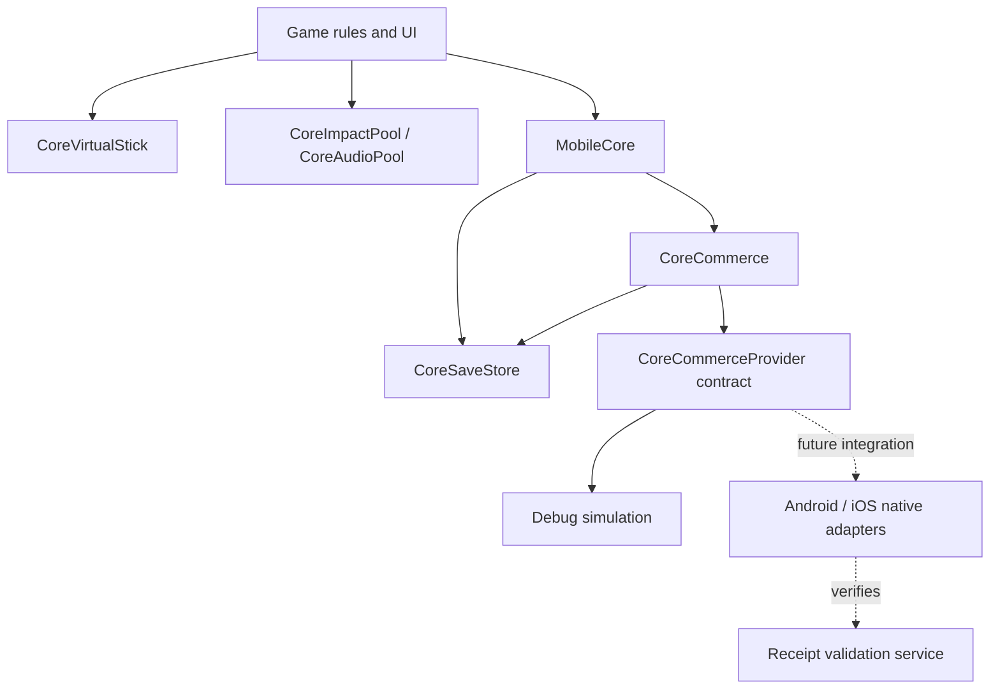

# Reusing the mobile core

Godot supplies the rendering, scene system and platform exports. `mobile_core` is a small shared module above Godot, not a second engine. It has no imports from `game/` and contains no boxing rules, product IDs, or Ring Rush balance values.



## Add another game

1. Copy `addons/mobile_core/` into the new Godot project.
2. Add `res://addons/mobile_core/mobile_core.gd` as the `MobileCore` autoload.
3. Choose a distinct app name / bundle ID so `user://` saves are isolated.
4. Call `MobileCore.configure_commerce(catalog, placements, optional_native_adapter)` once during startup. Each game owns its product IDs, prices displayed by a native store, and reward values.
5. Instantiate `CoreImpactPool`, `CoreAudioPool`, and `CoreVirtualStick` where needed. Enable the stick only during gameplay; feed its normalized vector into the game's camera-relative movement mapping.

```gdscript
MobileCore.configure_commerce(
    {"your_product": {"entitlement": "your_cosmetic"}},
    {"optional_bonus": 50}
)
MobileCore.commerce.reward("optional_bonus")
MobileCore.commerce.buy("your_product")
MobileCore.commerce.restore()
# An adapter can be passed as the third argument without changing the core.
```

The mock is selected only when both `OS.is_debug_build()` and `mobile_core/monetization/allow_debug_mock` are true. Without a native adapter, release builds report unavailable. An editor executable always counts as a debug build; test release behavior using a release export or by disabling the project setting.

## Persistence

The schema contains a version, coins, entitlements, processed transaction IDs, game progress, and settings. A grant adds the value and its transaction ID to one document. Save writes a temporary file, flushes it, preserves a backup and renames the new document into place. A failed commit leaves the in-memory balance unchanged. On load, invalid primary JSON falls back to the previous valid backup.

This is local persistence, not anti-cheat or cloud synchronization. A backup may be one transaction behind. The transaction ledger grows with grants; a production backend should own financial transaction history and support reconciliation. Unsupported future schema versions now block writes; implement a migration before introducing schema 2. Ring Rush checkpoints coin/KO progress every 15 seconds and on suspension, then settles an interrupted run on the next launch.

## Commerce contract

Providers subclass `CoreCommerceProvider`. Methods are `show_rewarded(request_id, placement)`, `purchase(request_id, product)`, and `restore(request_id)`. All callbacks must enter Godot on its main thread.

| Callback | Meaning |
| --- | --- |
| `ad_finished(id, earned, reason)` | Earned must come from the SDK reward callback, not merely closing the ad. |
| `purchase_finished(id, product, transaction, verified, reason)` | Transaction is the stable store transaction ID; verified means validated by the trusted purchase pipeline. |
| `restore_finished(id, products, success, reason)` | Only verified non-consumable product IDs from the current catalog. |

One foreground request is allowed at a time. Unknown or duplicate ad callbacks do not grant rewards. Requests time out after 45 seconds. A verified purchase can reconcile after timeout or during app resume, independent of the foreground request. Failed local purchase writes must be retried from the store/backend; a success callback alone is not a store acknowledgement. Pending purchases, refunds, entitlement revocation, server-side ad verification, localized pricing, and consent orchestration belong to the native integration phase described in the release guide.

Restore currently merges valid entitlements; it does not revoke refunded products. No subscriptions or consumables are exposed by this game's catalog. Do not add either until their transaction lifecycle is implemented.

## Performance and lifecycle

The arena pools 48 enemies and 64 pickups. Effects cap at 192 instanced particles, 12 shockwave rings, 16 damage labels and six audio voices. Crowd separation queries neighboring spatial buckets. Fighter details bake into six animated mesh surfaces cached by role/cosmetic; the hero is more detailed than small crowd actors. Chairs, audience and particle geometry use MultiMesh. Combat advances on the fixed physics tick. The renderer uses Godot Compatibility; battery saver disables shadows, audience and anti-aliasing. Profile physical mobile hardware before increasing these budgets.

Focus loss and app suspension pause the active run. Returning requires an explicit resume. Ability selection also freezes gameplay. The visual/sound pools can finish their existing effects during a pause. Native fullscreen ads should be requested from non-combat screens or coordinated with the game's pause state.

The UI expands to the available viewport aspect and applies `DisplayServer.get_display_safe_area()` insets on mobile. Skill buttons handle a second touch without taking control of the movement stick. Phone and tablet renders were inspected, but physical cutouts, system bars and foldables still require testing.

## Ring Rush extension points

`RushBalance` owns the 18-skill catalog, rank caps, three stage definitions and training choices. `RushProgress` wraps core save commits to atomically settle coins, stage unlocks and run records; this stays outside the reusable core. `RushModelFactory` caches vertex-colored, single-surface articulated parts. `RushBoxer` resets status and animation state when pooled actors change roles. The game supplies colors, radii and damage text to the core VFX pool.
