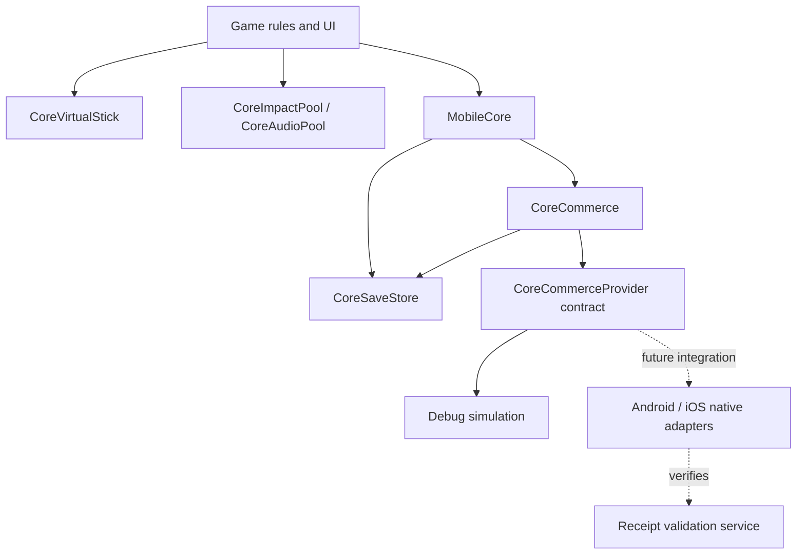

# Reusing the mobile core

Godot supplies the rendering, scene system and platform exports. `mobile_core` is a small shared module above Godot, not a second engine. It has no imports from `game/` and contains no boxing rules, product IDs, or Ring Rush balance values.



## Add another game

1. Copy `addons/mobile_core/` into the new Godot project.
2. Add `res://addons/mobile_core/mobile_core.gd` as the `MobileCore` autoload.
3. Choose a distinct app name / bundle ID so `user://` saves are isolated.
4. Call `MobileCore.configure_commerce(catalog, placements, optional_native_adapter)` once during startup. Each game owns its product IDs, prices displayed by a native store, and reward values.
5. Instantiate `CoreImpactPool`, `CoreAudioPool`, and `CoreVirtualStick` where needed. Enable the stick only during gameplay; feed its normalized vector into the game's camera-relative movement mapping.

```gdscript
MobileCore.configure_commerce(
    {"your_product": {"entitlement": "your_cosmetic"}},
    {"optional_bonus": 50}
)
MobileCore.commerce.reward("optional_bonus")
MobileCore.commerce.buy("your_product")
MobileCore.commerce.restore()
# An adapter can be passed as the third argument without changing the core.
```

The mock is selected only when both `OS.is_debug_build()` and `mobile_core/monetization/allow_debug_mock` are true. Without a native adapter, release builds report unavailable. An editor executable always counts as a debug build; test release behavior using a release export or by disabling the project setting.

## Persistence

The schema contains a version, coins, entitlements, processed transaction IDs, game progress, and settings. A grant adds the value and its transaction ID to one document. Save writes a temporary file, flushes it, preserves a backup and renames the new document into place. A failed commit leaves the in-memory balance unchanged. On load, invalid primary JSON falls back to the previous valid backup.

This is local persistence, not anti-cheat or cloud synchronization. A backup may be one transaction behind. The transaction ledger grows with grants; a production backend should own financial transaction history and support reconciliation. Unsupported future schema versions now block writes; implement a migration before introducing schema 2. Ring Rush stores a JSON-safe combat snapshot every 15 seconds, on wave clears and on suspension. Valid snapshots resume to a paused screen. Legacy/incomplete snapshots bank their last saved coins. `RushRunSnapshot` validates expected fields before restoration; the run ID persists across restart so final rewards remain idempotent.

## Commerce contract

Providers subclass `CoreCommerceProvider`. Methods are `show_rewarded(request_id, placement)`, `show_interstitial(request_id, placement)`, `set_banner(visible)`, `cancel(request_id)`, `purchase(request_id, product)`, and `restore(request_id)`. All callbacks must enter Godot on its main thread.

| Callback | Meaning |
| --- | --- |
| `ad_finished(id, earned, reason)` | Earned must come from the SDK reward callback, not merely closing the ad. |
| `interstitial_finished(id, shown, reason)` | Display/dismissal outcome; never awards currency. |
| `purchase_finished(id, product, transaction, verified, reason)` | Transaction is the stable store transaction ID; verified means validated by the trusted purchase pipeline. |
| `restore_finished(id, products, success, reason)` | Only verified non-consumable product IDs from the current catalog. |

`reward_context(placement, context)` stores earned receipts in a durable outbox before emitting `reward_ready`. Ring Rush's `RushAdRewards` consumes each receipt and changes HP/coins plus its deduplication ledger in one commit. The core owns no boxing-specific reward rules. A failed benefit commit leaves the receipt for retry on launch. `CoreAdBreak` is an explicit debug creative; native SDKs own video rendering and closing controls.

One foreground request is allowed at a time. Unknown or duplicate ad callbacks do not grant rewards. Requests time out after 45 seconds. A verified purchase can reconcile after timeout or during app resume, independent of the foreground request. Failed local purchase writes must be retried from the store/backend; a success callback alone is not a store acknowledgement. Pending purchases, refunds, entitlement revocation, server-side ad verification, localized pricing, and consent orchestration belong to the native integration phase described in the release guide.

Restore currently merges valid entitlements; it does not revoke refunded products. No subscriptions or consumables are exposed by this game's catalog. Do not add either until their transaction lifecycle is implemented.

## Performance and lifecycle

The arena pools 48 enemies and 64 pickups. Effects cap at 192 instanced particles, 12 shockwave rings, 48 instanced crack segments, 16 damage labels and six audio voices. Crowd separation queries neighboring spatial buckets. The hero uses the imported textured humanoid skeleton. Crowd actors share two-surface mesh poses baked offline from that same rig at 24 Hz, with reduced geometry and unused attributes/vertices removed. A crowd actor changes its mesh reference instead of evaluating a skeleton. Chairs, audience and particle geometry use MultiMesh. Combat advances on the fixed physics tick. The renderer uses Godot Compatibility; battery saver disables shadows, stadium audience and anti-aliasing. Perimeter crowds remain instanced. Profile physical mobile hardware before increasing these budgets.

Focus loss and app suspension pause the active run. Returning requires an explicit resume. Ability selection also freezes gameplay. The visual/sound pools can finish their existing effects during a pause. Native fullscreen ads should be requested from non-combat screens or coordinated with the game's pause state.

The UI expands to the available viewport aspect and applies `DisplayServer.get_display_safe_area()` insets on mobile. Skill buttons handle a second touch without taking control of the movement stick. Phone and tablet renders were inspected, but physical cutouts, system bars and foldables still require testing.

## Ring Rush extension points

`RushBalance` owns the 18-skill catalog, rank caps, five stage definitions and training choices. `RushRoster` owns character/move catalogs, coin unlocks and equipped selections. `RushWaveDirector` owns finite quotas, recovery breaks, wave modifiers and challenge lengths. `RushProgress` wraps core save commits to atomically settle coins, stage unlocks and run records; this stays outside the reusable core. `RushModelFactory` batches environment pieces and accessories; `RushCrowdLibrary` holds shared humanoid pose meshes generated by the offline baker. `RushArenaLayout` shares convex boundaries and circular blockers between movement, dash substeps, enemy steering, spawn placement and venue thumbnails. `RushWardrobe` attaches equipment to the male/female rigs; body changes happen in menus rather than per combat frame. `RushBoxer` resets status and animation state when pooled actors change roles. The game supplies colors, radii and damage text to the core VFX pool.


## Asset and music pipeline

The CC0 model and selected compatible animation tracks are assembled into `assets/fighters/boxer.gltf` by `tools/prepare_fighter.py`; `tools/prepare_female.py` assembles the second anatomy and preserves its limb lengths when reusing animation rotations. Original source downloads live under a `.gdignore` directory and are excluded from Godot exports. `tools/bake_crowd.gd` must run with the native renderer because skin pose baking needs a registered render skeleton; it fails explicitly in headless mode. It creates a compressed 8.1 MB pose library and preserves the high-detail hero separately.

`tools/generate_score.py` synthesizes three original stereo music loops and five combat effects. Music plays separately from the bounded SFX voice pool. Both have persistent mute settings. No commercial song samples are used.

## Presentation lifecycle

`RushFollowCamera` owns dead-zone smoothing and aspect-aware combat framing. `RushHUD.abilities` keeps the playing screen alive beneath a separate scrim/panel; only the popup is animated. The game remains in `upgrade` through its short exit, blocking duplicate choice taps. `clear` removes an existing overlay and resets model-rotation ownership. Menu pages use `RushMenuBackdrop`, and character visibility is explicitly selected per page.

A defeated `RushBoxer` immediately leaves the active targeting/wave collection but enters a bounded `knockouts` list. Its shared `Death01` poses play for 0.72 seconds, hold until 1.10 and fade by 1.45 seconds. These poses sample the licensed animation offline into 18 meshes. Spawn avoids dying actors when possible; all actors still belong to the same pool of 48. Reconfiguration restores opacity, status, transform and targeting state.

Fading uses each actor's existing surface materials because Godot's instance transparency is ignored by Mobile/Compatibility. See the [Godot 4.5 property documentation](https://docs.godotengine.org/en/4.5/classes/class_geometryinstance3d.html#class-geometryinstance3d-property-transparency). This avoids relying on a desktop-only visual feature in the mobile core renderer.

## Refinement: readable combat, progression and enemy families

`RushContentButton` derives its minimum height from a margin container instead of fixing skill cards to 110 pixels. The upgrade panel centers its content, caps the choices viewport to the available safe height and scrolls only when necessary. A blue panel and semantic card colors preserve the current visual identity. Toast labels use symmetric margins and explicit vertical alignment. Home navigation floats at the right, with a gym shortcut at the left and the Play action above the banner at the bottom.

`RushTraining` validates the five stat IDs, level cap and live cost before asking `CoreSaveStore` to commit. Damage, health, starting charge and movement apply at run start; mastery scales technique cooldown. Older power/health/charge save keys remain valid. Coin packs use `CoreCommerce`'s existing verified-transaction grant and deduplication path. They are consumables without permanent entitlements and never replenish through Restore. Native adapters still need store product metadata, trusted verification, transaction consumption/acknowledgment only after durable granting, and retry of interrupted grants; this build uses clearly labeled free simulation.

Essential skill feedback (pooled strokes, lightning, rings, cracks) remains visible when the saved `effects` preference disables decorative sparks, numbers, impact flashes and shake. All effect geometry is bounded: 192 particles, 12 rings, 48 strokes, 48 crack segments and 16 numbers. VFX bounds accommodate the larger arenas. `RushArenaLayout.SCALE = 1.30` expands both axes, giving 69% more playable area; render geometry, collision boundaries, spawns, blockers and foundry hazards use matching coordinates. Combat retains its close follow camera.

Crowds now use three shared pose libraries: the original boxer, a female agile silhouette with hair/mask/scarf, and an armored heavyweight. Each still renders through two surfaces, without per-enemy skeletons. The same 48 actor pool handles seven roles: rookie, runner, brute, boss, charger, spark and guard. Chargers commit to a warned line and use swept collision with one hit per rush; sparks lock a delayed strike position that can be dodged; guards mitigate ordinary punches while techniques bypass armor. New types enter finite waves from wave four. Restoring a snapshot resets pending enemy attacks and gives at least 0.8 seconds of grace, since transient telegraphs are not serialized.
