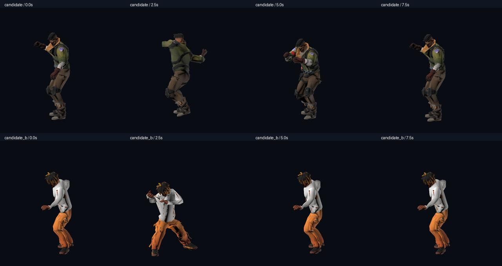

# 两个 FBX 的适用性检查

两份文件都能由 Godot 4.5.1 的 ufbx 导入。它们适合作为新角色的美术来源，目前还不能直接替代完整的战斗角色。

| 文件 | 原始三角面 | 减面预览三角面 | 骨骼 | 原始动画 | 主贴图 |
| --- | ---: | ---: | ---: | --- | --- |
| `20250825151802_aa414692ab9ec2c7_moved.fbx` | 499,883 | 12,481 | 27 | 一段 10.375 秒，22 条轨道 | 2048 × 2048 |
| `20250825152552_fd02fb5796b66d39_moved.fbx` | 499,952 | 10,840 | 27 | 一段 10.375 秒，22 条轨道 | 2048 × 2048 |

原文件保留在用户 Downloads；项目内副本和减面场景位于 `assets/fighters/custom/`。两份预览保留骨骼、权重、UV 和贴图，已在原动画的四个时间点检查。减面是自动 LOD 选择与未引用顶点压缩，并非人工重新拓扑；近距离面部和极端动作仍需美术复核。

已尝试把现有七种动作映射至这两份 27 骨骼模型。结果出现手臂朝向和躯干姿势偏差，第二个角色更明显。因此 `_combat.scn` 是**失败的重定向实验**，没有接入游戏角色列表。预览、原始 FBX 和实验文件均被 Android/iOS 导出预设排除，避免原始高面数资源增大发行包。

下一步需要这些模型的原始 **T-pose / A-pose 绑定文件**，或与其骨骼匹配的独立动作：Idle、Run、Jab、Cross、Hit、Death、Slam/Jump Land。需要检查绑定姿势、手腕朝向、脚底高度，并重新做动作重定向。模型有 27 根骨骼不等于能直接兼容项目现有的 65 骨骼动作。

建议交付 FBX 或 GLB；带贴图、骨骼、权重，角色脚底在原点，约真人米制比例，动作在原地播放。12k/11k 的预览已进入可评估的主角面数范围，最终手机预算仍以目标 Android/iPhone 实测为准。STL 更适合静态道具，需要另做绑定才能成为战斗角色；USDZ 需要转换并检查材质及骨骼。

工具：`tools/inspect_models.gd`（原始 / `--optimized` / `--combat`）、`tools/optimize_models.gd`、`tools/retarget_fighters.gd`（仅诊断实验）。格式依据：[Godot 3D 导入说明](https://docs.godotengine.org/en/stable/tutorials/assets_pipeline/importing_3d_scenes/available_formats.html)。用户提供的模型来源和授权不归入 Quaternius CC0 声明。
